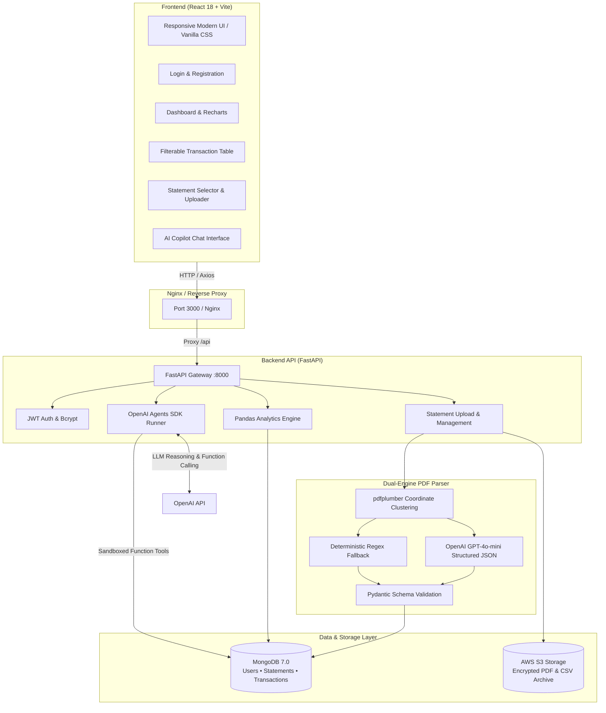

<div align="center">

# SpendWise — PhonePe & Bank Statement Financial Intelligence Platform

<p align="center">
  <strong>An end-to-end, full-stack financial intelligence platform that parses password-protected PhonePe statement PDFs, extracts transactions via coordinate-based & AI clustering, provides real-time interactive analytics, and features an autonomous AI Financial Copilot.</strong>
</p>

[](https://fastapi.tiangolo.com/)
[](https://react.dev/)
[](https://vitejs.dev/)
[](https://www.mongodb.com/)
[](https://openai.com/)
[](https://www.python.org/)
[](https://www.docker.com/)
[](https://aws.amazon.com/s3/)
[](LICENSE)

---

[Key Features](#key-features) • [System Architecture](#system-architecture) • [Tech Stack](#tech-stack) • [Quickstart (Docker)](#quickstart-docker-compose) • [Manual Setup](#local-development-setup) • [API Reference](#api-documentation) • [PDF Parser Engine](#deep-dive-pdf-extraction-engine) • [Author](#author)

---

</div>

## Overview

**SpendWise** (PhonePe Bank Statement Analyzer) solves the messy reality of personal finance tracking in India's UPI ecosystem. PhonePe statement PDFs often come password-protected, contain complex multi-line cell layouts, and suffer from digital extraction bugs (e.g. line-breaks splitting numbers like `INR\n17000.00`). 

SpendWise provides:
1. **Intelligent PDF Ingestion**: A dual-engine parser that combines coordinate-based bounding box clustering with OpenAI GPT-4o-mini structured extraction (backed by a deterministic local regex fallback).
2. **Interactive Financial Analytics**: High-performance metric computation via Pandas and dynamic Recharts data visualizations.
3. **Multi-Statement Intelligence**: Individual statement management, custom renaming, and unified multi-statement aggregation.
4. **Autonomous AI Financial Copilot**: Built with the OpenAI Agents SDK, utilizing sandboxed function-calling tools that query your scoped MongoDB records directly.
5. **Production-Ready Multi-Tenancy**: End-to-end user isolation with JWT authentication, S3 cloud document archiving, and complete one-click account data erasure.

---

## Key Features

### 📄 Dual-Engine PDF Ingestion & Extraction
- **Password Support:** Handles encrypted/password-protected PhonePe statement PDFs seamlessly.
- **Coordinate-Based Word Clustering:** Employs `pdfplumber` bounding box clustering (`x0`, `top`, `y_tolerance`) to reconstruct tabular rows accurately across arbitrary page widths.
- **AI Structured Extraction:** Formats clustered blocks into structured JSON via OpenAI (`gpt-4o-mini`), validated with Pydantic schemas.
- **Deterministic Regex Fallback:** Fully functional offline mode using local pattern recognition if OpenAI is disabled or unavailable.
- **Deduplication Engine:** Compound indexing ensures duplicate statements or re-uploaded transactions are never duplicated in the database.

### 📊 Financial Analytics & Insights
- **Core Financial Metrics:** Real-time calculation of Total Debits (Expenses), Total Credits (Income), Net Cash Flow, Average Daily Spend (calendar-basis), and Average Monthly Spend.
- **Interactive Visualizations:**
  - **Spending Trend:** Granular daily or monthly area charts.
  - **Category Breakdown:** Interactive donut charts highlighting expense distribution.
  - **Top Counterparties:** Bar chart ranking highest-spend recipients and merchants.
- **Flexible Date & Statement Scoping:** Analyze metrics across all combined statements or isolate a single uploaded statement.

### 📁 Multi-Statement Management
- Upload and maintain multiple monthly or yearly statements simultaneously.
- **Interactive Statement Switcher:** View individual statement performance or toggle to "All Statements (Combined)".
- **In-Place Renaming:** Customize statement labels directly in the UI (e.g., *"October 2024 Expenses"*).
- **S3 Document Archival:** Uploaded statements are securely saved to Amazon S3 for long-term document retrieval.

### 🤖 AI Financial Copilot (OpenAI Agents SDK)
- Conversational financial assistant grounded in your real transaction records.
- **Sandboxed Function Calling Tools:**
  - `get_financial_summary`: Queries net cash flow, income, expense, and daily/monthly averages.
  - `get_top_recipients`: Identifies top payment recipients by debit volume.
  - `get_spending_trend`: Analyzes spending patterns across dates.
  - `search_transactions`: Finds specific payments by merchant, amount range, or category.
- **Zero Prompt Injection Risk:** Functions are programmatically closed over the authenticated user's ID server-side. The model cannot access another user's records.

### 🏷️ Smart Categorization & Bulk Updates
- **Automatic Heuristic Classification:** Instant mapping of counterparties to categories (Food, Groceries, Recharge & Bills, Shopping, Travel, Health, Entertainment, Investment).
- **Batch Editing (`update_all_matching`):** Updating a counterparty's category automatically propagates to all past transactions with that same recipient.

### 🔒 Enterprise Security & Privacy
- **Stateless JWT Auth:** Secure access and refresh token lifecycle.
- **Password Hashing:** Passwords encrypted using `passlib` with `bcrypt`.
- **Tenant Isolation:** Every database operation strictly enforces `{"user_id": current_user["_id"]}`.
- **GDPR-Style Account Deletion:** One-click account purge completely deletes the user profile, all MongoDB transaction records, and associated files in Amazon S3.
- **Data Export:** Filtered transaction history exportable to CSV on demand with automatic S3 archival.

---

## System Architecture



---

## Tech Stack

| Domain | Technology | Description |
| :--- | :--- | :--- |
| **Frontend** | [React 18](https://react.dev/) | Component-driven UI library |
| | [Vite 5](https://vitejs.dev/) | Next-generation frontend build tooling |
| | [Recharts 2](https://recharts.org/) | Composable data visualization charts |
| | [Axios](https://axios-http.com/) | Promise-based HTTP client with interceptors |
| | [React Router 6](https://reactrouter.com/) | Client-side routing and protected routes |
| | [Vanilla CSS](https://developer.mozilla.org/en-US/docs/Web/CSS) | Clean, modular CSS tokens with dark aesthetic |
| **Backend** | [FastAPI](https://fastapi.tiangolo.com/) | High-performance asynchronous Python web framework |
| | [Motor](https://motor.readthedocs.io/) | Asynchronous Python driver for MongoDB |
| | [Pandas](https://pandas.pydata.org/) | Data manipulation and statistical calculations |
| | [Pydantic 2](https://docs.pydantic.dev/) | Strict data validation and schema enforcement |
| | [Passlib & Bcrypt](https://passlib.readthedocs.io/) | Secure password hashing algorithms |
| | [Python-Jose](https://python-jose.readthedocs.io/) | JSON Web Token (JWT) encode/decode |
| **Extraction** | [pdfplumber](https://github.com/jsvine/pdfplumber) | Coordinate-level word extraction & layout grouping |
| | [PyPDF2](https://pypdf2.readthedocs.io/) | PDF decryption & metadata handling |
| **AI Copilot** | [OpenAI Agents SDK](https://github.com/openai/openai-agents-python) | Multi-turn agent with function tools |
| | [GPT-4o-mini](https://platform.openai.com/) | Cost-efficient, high-speed structured extraction |
| **Cloud & DevOps**| [MongoDB 7.0](https://www.mongodb.com/) | NoSQL document database with compound indexing |
| | [AWS S3 / Boto3](https://aws.amazon.com/s3/) | Secure remote object storage for statements & CSVs |
| | [Docker & Compose](https://www.docker.com/) | Multi-container application orchestration |
| | [Nginx](https://www.nginx.com/) | Static asset delivery and reverse proxy |

---

## Repository Structure

```
SpendWise/
├── backend/
│   ├── app/
│   │   ├── main.py              # FastAPI app lifecycle, CORS, route registry
│   │   ├── config.py            # Pydantic BaseSettings environment config
│   │   ├── database.py          # Motor async client & index initialization
│   │   ├── auth.py              # Password hashing, JWT token issue/decode
│   │   ├── schemas.py           # Pydantic request, response & validation models
│   │   ├── routers/
│   │   │   ├── auth_router.py   # /auth/signup, /auth/login, /auth/refresh, /auth/me
│   │   │   ├── upload.py        # /statements/upload, /statements, /statements/{id}
│   │   │   ├── transactions.py  # /transactions (CRUD, batch category, CSV export)
│   │   │   ├── dashboard.py     # /dashboard/summary, /top-recipients, /trend, /categories
│   │   │   └── assistant.py     # /assistant/chat (AI copilot conversational endpoint)
│   │   └── services/
│   │       ├── pdf_parser.py    # Coordinate clustering + OpenAI + regex fallback parser
│   │       ├── analytics.py     # Pandas financial metric & trend calculations
│   │       ├── s3_service.py    # AWS S3 file upload, presigned URLs & user folder purge
│   │       ├── ai_agent.py      # OpenAI Agents SDK with closed function tools
│   │       └── diagnose_parser.py # Diagnostic utilities for parser inspection
│   ├── .env.example             # Backend environment template
│   ├── Dockerfile               # Multi-stage Python 3.10 production image
│   └── requirements.txt         # Pinned Python package dependencies
├── frontend/
│   ├── src/
│   │   ├── api.js               # Axios instance, auto-refresh token interceptors & API client
│   │   ├── context.js           # ActiveStatement React context provider
│   │   ├── index.css            # Dark-mode design system & component styles
│   │   ├── main.jsx             # React DOM entrypoint
│   │   ├── App.jsx              # Main shell layout, sidebar navigation, statement selector
│   │   └── components/
│   │       ├── Login.jsx        # Authentication (Sign in & Sign up)
│   │       ├── UploadPDF.jsx    # Drag-and-drop PDF uploader with password input
│   │       ├── Dashboard.jsx    # Analytics cards, Recharts trends & category donut
│   │       ├── TransactionTable.jsx # Paginated table, search, category editor & CSV export
│   │       └── AIAssistant.jsx  # Real-time conversational AI copilot chat
│   ├── .env.example             # Frontend environment template
│   ├── Dockerfile               # Production multi-stage build + Nginx container
│   ├── nginx.conf               # Nginx reverse proxy configuration
│   ├── vite.config.js           # Vite dev server configuration & /api proxy
│   └── package.json             # Frontend dependencies and scripts
├── docker-compose.yml           # Unified orchestration (Mongo 7 + Backend + Frontend)
├── .gitignore                   # Ignore rules for environments, virtualenvs, build artifacts
└── README.md                    # Project documentation
```

---

## Quickstart (Docker Compose)

The fastest, zero-config way to launch the full SpendWise stack is via Docker Compose.

### 1. Clone the Repository
```bash
git clone https://github.com/shashankpatil-cs/PPBankStatAnaly.git
cd PPBankStatAnaly
```

### 2. Configure Environment Files
Copy the example templates for both backend and frontend:

**Linux / macOS (Bash):**
```bash
cp backend/.env.example backend/.env
cp frontend/.env.example frontend/.env
```

**Windows (PowerShell):**
```powershell
Copy-Item backend\.env.example backend\.env
Copy-Item frontend\.env.example frontend\.env
```

*(Optional: Add your `OPENAI_API_KEY` in `backend/.env` to enable the AI Copilot).*

### 3. Build & Launch Containers
```bash
docker compose up --build -d
```

### 4. Verify Running Services
```bash
docker compose ps
```

| Service | URL | Notes |
| :--- | :--- | :--- |
| **Frontend Web App** | [http://localhost:3000](http://localhost:3000) | Main user interface |
| **Backend API Docs (Swagger)** | [http://localhost:8000/docs](http://localhost:8000/docs) | Interactive OpenAPI testing |
| **Backend Health Check** | [http://localhost:8000/health](http://localhost:8000/health) | `{"status":"ok"}` |
| **MongoDB Database** | `mongodb://localhost:27017` | Persisted to named volume `mongo_data` |

To follow live logs:
```bash
docker compose logs -f backend
```

To stop containers:
```bash
docker compose down
```

---

## Local Development Setup

If you prefer running services directly on your host machine with instant hot-reloading:

### Prerequisites
- **Python:** 3.10 or 3.11+
- **Node.js:** 18.0+ and npm 9+
- **MongoDB:** Local instance or Docker container on port `27017` (e.g. `docker run -d -p 27017:27017 --name phonepe-mongo mongo:7`)

---

### Step 1: Start MongoDB
Ensure a MongoDB instance is reachable at `mongodb://localhost:27017`.

---

### Step 2: Set Up Backend (FastAPI)

1. Open a terminal and navigate to `backend`:
   ```bash
   cd backend
   ```

2. Create and activate a Python virtual environment:
   - **Windows (PowerShell):**
     ```powershell
     python -m venv venv
     .\venv\Scripts\Activate.ps1
     ```
   - **Windows (CMD):**
     ```cmd
     python -m venv venv
     venv\Scripts\activate.bat
     ```
   - **macOS / Linux:**
     ```bash
     python3 -m venv venv
     source venv/bin/activate
     ```

3. Install dependencies:
   ```bash
   pip install -r requirements.txt
   ```

4. Configure `.env`:
   Make sure `backend/.env` exists and contains your settings:
   ```env
   MONGO_URI=mongodb://localhost:27017
   MONGO_DB_NAME=phonepe_analyzer
   JWT_SECRET=use-a-strong-secret-key-here
   JWT_ALGORITHM=HS256
   JWT_EXPIRE_MINUTES=10080
   CORS_ORIGINS=http://localhost:3000,http://localhost:5173
   UPLOAD_DIR=./uploads
   OPENAI_API_KEY=your-openai-api-key-optional
   OPENAI_MODEL=gpt-4o-mini
   ```

   > [!TIP]
   > Generate a cryptographically secure 256-bit `JWT_SECRET`:
   > ```bash
   > python -c "import secrets; print(secrets.token_hex(32))"
   > ```

5. Start the backend development server:
   ```bash
   uvicorn app.main:app --reload --host 0.0.0.0 --port 8000
   ```
   Interactive Swagger docs are now live at [http://localhost:8000/docs](http://localhost:8000/docs).

---

### Step 3: Set Up Frontend (React + Vite)

1. Open a second terminal window and navigate to `frontend`:
   ```bash
   cd frontend
   ```

2. Install dependencies:
   ```bash
   npm install
   ```

3. Verify `frontend/.env`:
   ```env
   VITE_API_BASE_URL=/api
   ```

4. Start the Vite development server:
   ```bash
   npm run dev
   ```

5. Open [http://localhost:5173](http://localhost:5173) in your browser. Vite's proxy automatically routes all `/api/*` calls to the FastAPI backend at `http://localhost:8000`.

---

## Environment Variables Reference

### Backend (`backend/.env`)

| Variable | Default Value | Required | Description |
| :--- | :--- | :---: | :--- |
| `MONGO_URI` | `mongodb://localhost:27017` | **Yes** | MongoDB connection string (`mongodb://mongo:27017` for Docker Compose). |
| `MONGO_DB_NAME` | `phonepe_analyzer` | **Yes** | Database name to use in MongoDB. |
| `JWT_SECRET` | `change-me-in-production` | **Yes** | Cryptographic secret for signing JWT access and refresh tokens. |
| `JWT_ALGORITHM` | `HS256` | **Yes** | Encryption algorithm for JWT tokens. |
| `JWT_EXPIRE_MINUTES` | `10080` | **Yes** | Token expiration window in minutes (10080 = 7 days). |
| `CORS_ORIGINS` | `http://localhost:3000,http://localhost:5173` | **Yes** | Comma-separated list of permitted frontend client origins. |
| `UPLOAD_DIR` | `/tmp/phonepe_uploads` | **Yes** | Local temporary scratch folder during PDF parsing. |
| `OPENAI_API_KEY` | `""` | No | OpenAI API key (`sk-...`). Enables AI statement extraction and AI Copilot. |
| `OPENAI_MODEL` | `gpt-4o-mini` | No | Model ID used for AI Copilot and structured extraction. |
| `AWS_ACCESS_KEY_ID` | `""` | No | AWS Access Key for S3 PDF storage. If empty, local/Mongo storage is used. |
| `AWS_SECRET_ACCESS_KEY` | `""` | No | AWS Secret Access Key for S3. |
| `AWS_REGION` | `ap-south-1` | No | Target AWS region for S3 bucket operations. |
| `S3_BUCKET_NAME` | `phonepe-analyzer-bucket`| No | AWS S3 bucket name. |

### Frontend (`frontend/.env`)

| Variable | Default Value | Description |
| :--- | :--- | :--- |
| `VITE_API_BASE_URL` | `/api` | Base API prefix. In dev, Vite proxies `/api` to `http://localhost:8000`. In Docker, Nginx handles forwarding. |

---

## API Documentation

SpendWise provides clean, versioned REST endpoints documented via OpenAPI/Swagger:

### 1. Authentication (`/auth`)
| Method | Endpoint | Description | Auth Required |
| :--- | :--- | :--- | :---: |
| `POST` | `/auth/signup` | Register a new user account with name, email & password | No |
| `POST` | `/auth/login` | Authenticate using OAuth2 password flow; returns access & refresh tokens | No |
| `POST` | `/auth/refresh` | Exchange a valid refresh token for fresh tokens | No |
| `DELETE`| `/auth/me` | **Permanently deletes account**, cascading across MongoDB & S3 | **Yes** |

### 2. Statements & Uploads (`/statements`)
| Method | Endpoint | Description | Auth Required |
| :--- | :--- | :--- | :---: |
| `POST` | `/statements/upload` | Upload PDF statement (supports `pdf_password`, `statement_name`, `use_ai`) | **Yes** |
| `GET` | `/statements` | List all uploaded statements for the authenticated user | **Yes** |
| `PATCH`| `/statements/{id}` | Rename statement display name | **Yes** |
| `GET` | `/statements/ai-status` | Check if OpenAI is configured and operational on the server | **Yes** |

### 3. Transactions (`/transactions`)
| Method | Endpoint | Description | Auth Required |
| :--- | :--- | :--- | :---: |
| `GET` | `/transactions` | Filter & paginate transactions (search, date range, amount range, statement ID) | **Yes** |
| `PATCH`| `/transactions/{id}` | Update transaction category/counterparty (supports `update_all_matching`) | **Yes** |
| `DELETE`| `/transactions/{id}` | Delete a single transaction entry | **Yes** |
| `GET` | `/transactions/categories/list` | Fetch all distinct categories for the user | **Yes** |
| `GET` | `/transactions/export/csv` | Export filtered transactions to downloadable CSV & auto-archive to S3 | **Yes** |

### 4. Analytics & Dashboard (`/dashboard`)
| Method | Endpoint | Description | Auth Required |
| :--- | :--- | :--- | :---: |
| `GET` | `/dashboard/summary` | Aggregate financial totals (Debits, Credits, Net, Daily/Monthly Averages) | **Yes** |
| `GET` | `/dashboard/top-recipients` | Top N counterparties ranked by total spend | **Yes** |
| `GET` | `/dashboard/trend` | Spending/income trend over time (`granularity=daily` or `monthly`) | **Yes** |
| `GET` | `/dashboard/categories` | Expense breakdown grouped by category | **Yes** |

### 5. AI Copilot (`/assistant`)
| Method | Endpoint | Description | Auth Required |
| :--- | :--- | :--- | :---: |
| `POST` | `/assistant/chat` | Send conversational prompt; returns agent reply grounded in MongoDB | **Yes** |

---

## Deep Dive: PDF Extraction Engine

PhonePe statements feature tight, multi-column tables where transactions frequently span multiple wrapped lines. Traditional PDF parsing approaches (`extract_text()`) break because:
- Newline characters cut arbitrary text mid-cell (e.g. `INR\n17000.00` becomes `INR` on one line and `17000.00` on the next, often misread as `7000.00` or corrupting adjacent column data).
- Column coordinates vary dynamically depending on orientation and layout version.

### The SpendWise Dual-Engine Solution

```
┌────────────────────────────────────────────────────────┐
│               Uploaded PhonePe Statement PDF           │
└──────────────────────────┬─────────────────────────────┘
                           │
                           ▼
          [ Coordinate-Based Word Clustering ]
          • Extracts bounding boxes (x0, top) via pdfplumber
          • Clusters words into horizontal rows via vertical proximity
          • Detects column bounds (Date, Details, Type, Amount)
          • Anchors on Date cells to assemble cohesive transaction blocks
                           │
              ┌────────────┴────────────┐
              ▼                         ▼
   [ OpenAI Engine (Primary) ]   [ Deterministic Fallback ]
   • Sends clean block to LLM    • Regex parser over blocks
   • Structured JSON extraction  • Reassembles split amounts
   • Standardizes categories     • Resolves UTR / Txn IDs
              │                         │
              └────────────┬────────────┘
                           ▼
          [ Pydantic Schema Validation ]
          • Validates ISO dates, positive floats, transaction types
          • Rejects malformed records / hallucinations
                           │
                           ▼
          [ Deduplication & Compound Indexing ]
          • Unique sparse index on (user_id, txn_id)
          • Deduplicates on (date, amount, type, counterparty)
                           │
                           ▼
                  [ MongoDB Storage ]
```

1. **Word Bounding-Box Clustering (`pdfplumber`):** Rather than reading raw strings, SpendWise extracts low-level words with exact coordinate positions (`x0`, `top`). Rows are clustered using vertical proximity tolerances.
2. **Transaction Block Reassembly:** Each block is anchored by a date stamp. Wrapped text within the `Details` or `Amount` column is merged into a single cohesive transaction unit before parsing.
3. **Structured AI Extraction:** When OpenAI is configured, the reassembled transaction block is processed via `gpt-4o-mini` with a strict JSON schema. The model extracts the counterparty, normalized category, ISO date, transaction type, amount, and PhonePe/UTR transaction reference.
4. **Resilient Local Fallback:** If OpenAI is not configured or an API error occurs, an internal deterministic regex engine executes across the coordinate-assembled blocks with zero external dependencies.
5. **Pydantic Validation Guardrail:** Extracted records pass through `ExtractedTransactionValidation` before reaching the database, ensuring 100% data integrity.

---

## Security & Multi-Tenancy

- **Hardened Tenant Isolation:** Every transaction, statement, and export record is tagged with the user's UUID `user_id`. Backend endpoints extract `user_id` strictly from the cryptographically verified JWT payload.
- **Server-Closed AI Tools:** AI function tools are dynamically instantiated in a closure that fixes `user_id` on the server. The LLM has no mechanism or parameter to request data outside the authenticated user's scope.
- **Credential Protection:** Passwords are encrypted with `bcrypt` (12 rounds) and never stored or logged in plain text.
- **S3 Object Key Isolation:** Remote statement PDFs and CSV exports are strictly partitioned under `{user_id}/statements/` and `{user_id}/exports/`.
- **Complete Account Purge:** Triggering account deletion cascades across MongoDB (`users`, `statements`, `transactions`) and triggers asynchronous S3 folder deletion via AWS Boto3.

---

## Frequently Asked Questions

<details>
<summary><strong>1. Do I need an OpenAI API Key to use SpendWise?</strong></summary>

No! The application is fully functional without an OpenAI key. If `OPENAI_API_KEY` is omitted, SpendWise automatically uses its deterministic coordinate + regex parsing engine to extract all transactions, and all dashboard analytics, filtering, and CSV export capabilities operate normally. The key is only required if you wish to use the conversational AI Copilot or the AI extraction mode.
</details>

<details>
<summary><strong>2. How do I get my PhonePe statement PDF?</strong></summary>

Open the PhonePe mobile app, navigate to **History**, tap **Download Statement**, select your desired date range (e.g., last 3 months, 6 months, or custom financial year), and download the PDF. If the PDF requires a password, enter your registered mobile number or date of birth in the password field when uploading.
</details>

<details>
<summary><strong>3. Can I upload multiple statements for different months?</strong></summary>

Yes. SpendWise allows uploading multiple statements. You can switch between statements using the dropdown selector in the sidebar, rename them (e.g., "Jan 2024", "Feb 2024"), or select "All Statements (Combined)" to view your aggregate multi-month financial picture.
</details>

<details>
<summary><strong>4. How do I change an incorrectly categorized transaction?</strong></summary>

In the **Transactions** view, select any transaction and choose a new category from the dropdown (or type a custom one). You can check "Apply to all matching transactions" to instantly update all historical and future transactions associated with that counterparty.
</details>

---

## Author

Developed with care by **Shashank Patil**:

- **GitHub:** [@shashankpatil-cs](https://github.com/shashankpatil-cs)
- **Repository:** [shashankpatil-cs/PPBankStatAnaly](https://github.com/shashankpatil-cs/PPBankStatAnaly)

---

## License

This project is licensed under the [MIT License](LICENSE). Feel free to use, modify, and distribute it for personal and commercial applications.
